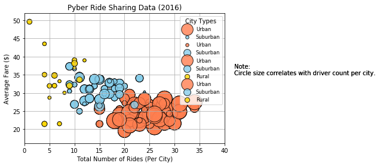
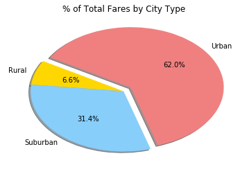
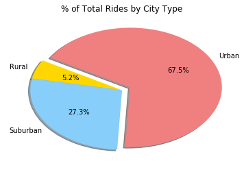
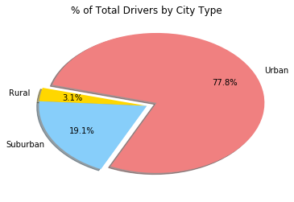

```python
# Dependencies and Setup
import matplotlib.pyplot as plt
import pandas as pd
import numpy as np

# Incorporate Seaborn if preferred 
import seaborn as sns

# File to Load (Remember to change these)
city_data_to_load = "raw_data/city_data.csv"
ride_data_to_load = "raw_data/ride_data.csv"

# Read the City and Ride Data
city_data = pd.read_csv(city_data_to_load)
ride_data = pd.read_csv(ride_data_to_load)

# Combine the data into a single dataset
city_ride_data = pd.merge(ride_data, city_data, how="left", on=["city", "city"])

# Display the data table for preview
city_ride_data[city_ride_data["city"]=="Sarabury"]
```


<div>
<style>
    .dataframe thead tr:only-child th {
        text-align: right;
    }

    .dataframe thead th {
        text-align: left;
    }

    .dataframe tbody tr th {
        vertical-align: top;
    }
</style>
<table border="1" class="dataframe">
  <thead>
    <tr style="text-align: right;">
      <th></th>
      <th>city</th>
      <th>date</th>
      <th>fare</th>
      <th>ride_id</th>
      <th>driver_count</th>
      <th>type</th>
    </tr>
  </thead>
  <tbody>
    <tr>
      <th>0</th>
      <td>Sarabury</td>
      <td>2016-01-16 13:49:27</td>
      <td>38.35</td>
      <td>5403689035038</td>
      <td>46</td>
      <td>Urban</td>
    </tr>
    <tr>
      <th>44</th>
      <td>Sarabury</td>
      <td>2016-07-23 07:42:44</td>
      <td>21.76</td>
      <td>7546681945283</td>
      <td>46</td>
      <td>Urban</td>
    </tr>
    <tr>
      <th>62</th>
      <td>Sarabury</td>
      <td>2016-04-02 04:32:25</td>
      <td>38.03</td>
      <td>4932495851866</td>
      <td>46</td>
      <td>Urban</td>
    </tr>
    <tr>
      <th>82</th>
      <td>Sarabury</td>
      <td>2016-06-23 05:03:41</td>
      <td>26.82</td>
      <td>6711035373406</td>
      <td>46</td>
      <td>Urban</td>
    </tr>
    <tr>
      <th>127</th>
      <td>Sarabury</td>
      <td>2016-09-30 12:48:34</td>
      <td>30.30</td>
      <td>6388737278232</td>
      <td>46</td>
      <td>Urban</td>
    </tr>
    <tr>
      <th>160</th>
      <td>Sarabury</td>
      <td>2016-08-04 00:25:52</td>
      <td>27.20</td>
      <td>2429366407526</td>
      <td>46</td>
      <td>Urban</td>
    </tr>
    <tr>
      <th>216</th>
      <td>Sarabury</td>
      <td>2016-07-25 10:44:01</td>
      <td>17.73</td>
      <td>4467299640441</td>
      <td>46</td>
      <td>Urban</td>
    </tr>
    <tr>
      <th>239</th>
      <td>Sarabury</td>
      <td>2016-06-22 16:24:01</td>
      <td>23.94</td>
      <td>6153395712431</td>
      <td>46</td>
      <td>Urban</td>
    </tr>
    <tr>
      <th>265</th>
      <td>Sarabury</td>
      <td>2016-01-27 17:46:45</td>
      <td>16.39</td>
      <td>8220809448298</td>
      <td>46</td>
      <td>Urban</td>
    </tr>
    <tr>
      <th>351</th>
      <td>Sarabury</td>
      <td>2016-04-26 11:31:30</td>
      <td>21.80</td>
      <td>5969441875705</td>
      <td>46</td>
      <td>Urban</td>
    </tr>
    <tr>
      <th>472</th>
      <td>Sarabury</td>
      <td>2016-08-14 19:56:59</td>
      <td>7.83</td>
      <td>4979570237054</td>
      <td>46</td>
      <td>Urban</td>
    </tr>
    <tr>
      <th>519</th>
      <td>Sarabury</td>
      <td>2016-01-06 03:02:55</td>
      <td>5.19</td>
      <td>9988466326333</td>
      <td>46</td>
      <td>Urban</td>
    </tr>
    <tr>
      <th>542</th>
      <td>Sarabury</td>
      <td>2016-03-29 15:47:35</td>
      <td>17.00</td>
      <td>3574423871181</td>
      <td>46</td>
      <td>Urban</td>
    </tr>
    <tr>
      <th>651</th>
      <td>Sarabury</td>
      <td>2016-11-20 11:44:23</td>
      <td>28.47</td>
      <td>3793266633941</td>
      <td>46</td>
      <td>Urban</td>
    </tr>
    <tr>
      <th>717</th>
      <td>Sarabury</td>
      <td>2016-07-17 20:41:06</td>
      <td>17.79</td>
      <td>9661023488490</td>
      <td>46</td>
      <td>Urban</td>
    </tr>
    <tr>
      <th>749</th>
      <td>Sarabury</td>
      <td>2016-11-06 02:23:59</td>
      <td>19.48</td>
      <td>7305651789766</td>
      <td>46</td>
      <td>Urban</td>
    </tr>
    <tr>
      <th>786</th>
      <td>Sarabury</td>
      <td>2016-09-26 07:30:31</td>
      <td>26.71</td>
      <td>6310253827816</td>
      <td>46</td>
      <td>Urban</td>
    </tr>
    <tr>
      <th>802</th>
      <td>Sarabury</td>
      <td>2016-06-04 20:50:52</td>
      <td>14.19</td>
      <td>8765571028809</td>
      <td>46</td>
      <td>Urban</td>
    </tr>
    <tr>
      <th>909</th>
      <td>Sarabury</td>
      <td>2016-01-22 23:12:06</td>
      <td>38.40</td>
      <td>1176229756048</td>
      <td>46</td>
      <td>Urban</td>
    </tr>
    <tr>
      <th>919</th>
      <td>Sarabury</td>
      <td>2016-03-29 19:07:55</td>
      <td>20.56</td>
      <td>7019491956393</td>
      <td>46</td>
      <td>Urban</td>
    </tr>
    <tr>
      <th>1037</th>
      <td>Sarabury</td>
      <td>2016-10-18 04:33:23</td>
      <td>37.50</td>
      <td>1054393799736</td>
      <td>46</td>
      <td>Urban</td>
    </tr>
    <tr>
      <th>1308</th>
      <td>Sarabury</td>
      <td>2016-09-30 20:41:18</td>
      <td>44.32</td>
      <td>2103508227691</td>
      <td>46</td>
      <td>Urban</td>
    </tr>
    <tr>
      <th>1314</th>
      <td>Sarabury</td>
      <td>2016-07-30 10:37:38</td>
      <td>25.99</td>
      <td>5233926699781</td>
      <td>46</td>
      <td>Urban</td>
    </tr>
    <tr>
      <th>1464</th>
      <td>Sarabury</td>
      <td>2016-04-01 07:15:24</td>
      <td>6.94</td>
      <td>1931215121299</td>
      <td>46</td>
      <td>Urban</td>
    </tr>
    <tr>
      <th>1497</th>
      <td>Sarabury</td>
      <td>2016-11-23 03:08:59</td>
      <td>37.17</td>
      <td>9141412183460</td>
      <td>46</td>
      <td>Urban</td>
    </tr>
    <tr>
      <th>1556</th>
      <td>Sarabury</td>
      <td>2016-10-23 02:40:28</td>
      <td>17.23</td>
      <td>1977978528067</td>
      <td>46</td>
      <td>Urban</td>
    </tr>
    <tr>
      <th>1614</th>
      <td>Sarabury</td>
      <td>2016-04-06 21:02:54</td>
      <td>7.14</td>
      <td>6096364843852</td>
      <td>46</td>
      <td>Urban</td>
    </tr>
  </tbody>
</table>
</div>


```python
# Obtain the x and y coordinates for each of the three city types
urban_cities = city_ride_data[city_ride_data["type"] == "Urban"]
suburban_cities = city_ride_data[city_ride_data["type"] == "Suburban"]
rural_cities = city_ride_data[city_ride_data["type"] == "Rural"]

urban_ride_count = urban_cities.groupby(["city"]).count()["ride_id"]
urban_avg_fare = urban_cities.groupby(["city"]).mean()["fare"]
urban_driver_count = urban_cities.groupby(["city"]).mean()["driver_count"]

suburban_ride_count = suburban_cities.groupby(["city"]).count()["ride_id"]
suburban_avg_fare = suburban_cities.groupby(["city"]).mean()["fare"]
suburban_driver_count = suburban_cities.groupby(["city"]).mean()["driver_count"]

rural_ride_count = rural_cities.groupby(["city"]).count()["ride_id"]
rural_avg_fare = rural_cities.groupby(["city"]).mean()["fare"]
rural_driver_count = rural_cities.groupby(["city"]).mean()["driver_count"]
```


```python
# Build the scatter plots for each city types
plt.scatter(urban_ride_count, 
            urban_avg_fare, 
            s=10*urban_driver_count, c="coral", 
            edgecolor="black", linewidths=1, marker="o", 
            alpha=0.8, label="Urban")

plt.scatter(suburban_ride_count, 
            suburban_avg_fare, 
            s=10*suburban_driver_count, c="skyblue", 
            edgecolor="black", linewidths=1, marker="o", 
            alpha=0.8, label="Suburban")

plt.scatter(rural_ride_count, 
            rural_avg_fare, 
            s=10*rural_driver_count, c="gold", 
            edgecolor="black", linewidths=1, marker="o", 
            alpha=0.8, label="Rural")

# Incorporate the other graph properties
plt.title("Pyber Ride Sharing Data (2016)")
plt.ylabel("Average Fare ($)")
plt.xlabel("Total Number of Rides (Per City)")
plt.xlim((0,40))
plt.grid(True)

# Create a legend
lgnd = plt.legend(fontsize="small", mode="Expanded", 
                  numpoints=1, scatterpoints=1, 
                  loc="best", title="City Types", 
                  labelspacing=0.5)
lgnd.legendHandles[0]._label = "hi"
lgnd.legendHandles[1]._sizes = [30]
lgnd.legendHandles[2]._sizes = [30]

# Incorporate a text label regarding circle size
plt.text(42, 35, "Note:\nCircle size correlates with driver count per city.")

# Save Figure
plt.savefig("Fig1.png")

# Show plot
plt.show()
```





```python
# Calculate Type Percents
type_percents = 100 * city_ride_data.groupby(["type"]).sum()["fare"] / city_ride_data["fare"].sum()

# Build Pie Chart
plt.pie(type_percents, 
        labels=["Rural", "Suburban", "Urban"], 
        colors=["gold", "lightskyblue", "lightcoral"], 
        explode=[0, 0, 0.1], 
        autopct='%1.1f%%', 
        shadow=True, startangle=150)
plt.title("% of Total Fares by City Type")

# Save Figure
plt.savefig("Fig2.png")

# Show Figure
plt.show()
```





```python
# Calculate Ride Percents
ride_percents = 100 * city_ride_data.groupby(["type"]).count()["ride_id"] / city_ride_data["ride_id"].count()

# Build Pie Chart
plt.pie(ride_percents, 
        labels=["Rural", "Suburban", "Urban"], 
        colors=["gold", "lightskyblue", "lightcoral"], 
        explode=[0, 0, 0.1], 
        autopct='%1.1f%%', 
        shadow=True, startangle=150)
plt.title("% of Total Rides by City Type")

# Save Figure
plt.savefig("Fig3.png")

# Show Figure
plt.show()
```





```python
# Calculate Driver Percents
driver_percents = 100 * city_data.groupby(["type"]).sum()["driver_count"] / city_data["driver_count"].sum()

# Build Pie Charts
plt.pie(driver_percents, 
        labels=["Rural", "Suburban", "Urban"], 
        colors=["gold", "lightskyblue", "lightcoral"], 
        explode=[0, 0, 0.1], 
        autopct='%1.1f%%', pctdistance=0.70,
        shadow=True, startangle=165)
plt.title("% of Total Drivers by City Type")

# Save Figure
plt.savefig("Fig4.png")

# Show Figure
plt.show()
```




