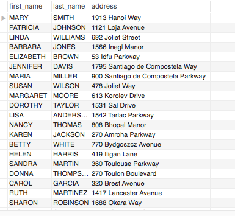
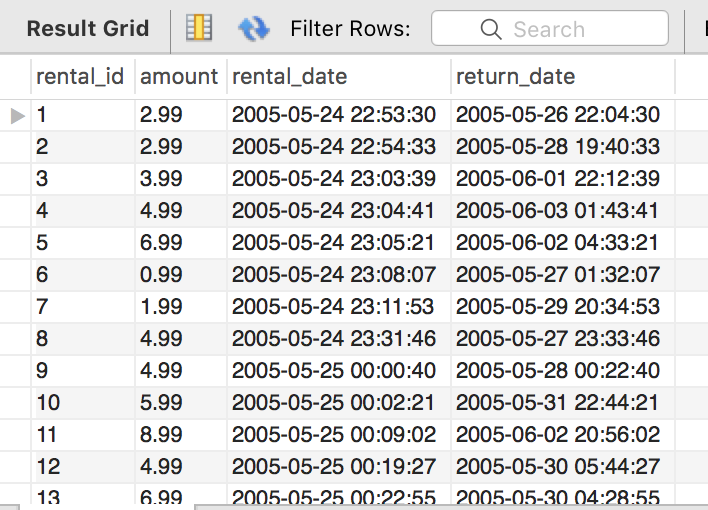

# The Arc of Join

## Instructions

* In this activity, you will use joins in querying multiple MySQL tables simultaneously. 

1. In the `sakila` database, write a query to display the first name, last name, and the street address of each customer. 

   

2. As the store manager, you would like to view the following for each rental that has taken place: the id of the rental, the cost of the rental, when the item was rented, and when it was returned: 

    

## Bonuses

* Begin looking into left outer joins in MySQL. What is the difference between an inner join and a left outer join? Does anything happen when you use a left outer join instead of inner join to solve the above problems? Why or why not?

## Hints

* In order to tackle these problems, you're advised to identify which tables you'll use, then figure out which columns you will need. 
