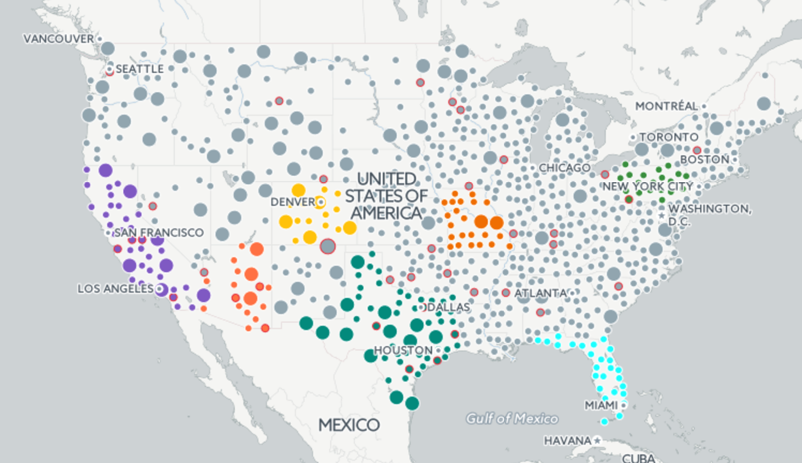

# Turbo CSS Solved

In this activity we utilized Turbo CARTO, CARTO's CSS preprocessor in order to style certain markers according to values they represent.

## Instructions

* We can create selectors for specific markers using the following syntax:

```css
#layer {
  property: value;
  [filter] {
    property: value;
  }
}
```

* The `filter` describes which columns we want to target.

  * Learn More: [Turbo Carto Docs](https://github.com/CartoDB/turbo-carto)

* For the basic solution, add the following styles to the McDonald's layer stylesheet:

```css
#layer {
  marker-width: 7;
  marker-fill: #90a4ae;
  marker-fill-opacity: 1;
  marker-allow-overlap: false;
  marker-line-width: 1;
  marker-line-color: #FFF;
  marker-line-opacity: 1;
  [state = 'PA'] {
    marker-fill: #388e3c;
  }
  [state = 'FL'] {
    marker-fill: #18ffff;
  }
  [state = 'AZ'] {
    marker-fill: #ff6e40;
  }
  [state = 'MO'] {
    marker-fill: #ef6c00;
  }
  [state = 'CO'] {
    marker-fill: #ffc107;
  }
  [state = 'TX'] {
    marker-fill: #00897b;
  }
  [state = 'CA'] {
    marker-fill: #7e57c2;
  }
  [freewifi = false] {
    marker-line-color: #e82a37;
  }
}
```



* [See a Working Demo](https://ceckenrode.carto.com/builder/49c7f85a-f54a-11e6-9ff7-0ee66e2c9693/embed)

* Use the following CSS for the bonus:

```css
#layer {
  marker-width: 7;
  marker-fill: #90a4ae;
  marker-fill-opacity: 1;
  marker-allow-overlap: false;
  marker-line-width: 1;
  marker-line-color: #FFF;
  marker-line-opacity: 1;

  /* Our ramp function */
  marker-fill: ramp([state], (#388e3c, #18ffff, #ff6e40, #ef6c00, #ffc107, #00897b, #7e57c2), ('PA', 'FL', 'AZ', 'MO', 'CO', 'TX', 'CA'));

  [freewifi = false] {
    marker-line-color: #e82a37;
  }
  [playplace = true] {
    marker-width: 14;
    marker-line-color: #3c74f7;
  }
}
```

* A basic ramp function is structured using the following syntax:

```css
#selector {
    property: ramp([column], (...values), (...filters));
}
```

* In a ramp function, filters and values are mapped to each other in the order they're written.

* You can learn more about ramps from the [Turbo Carto Docs](https://github.com/CartoDB/turbo-carto)
